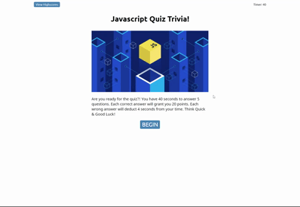

# 📖 Javascript Quiz Trivia Time!

## 💡 The Game

This is a Trivia web page game that has a set of questions, a timer and points. In today's quiz, you will be given 40 seconds for 5 questions. Each correct answer will grant you 20 points. Each wrong answer will deduct 4 seconds from your time.

## 💡 The design

* There are 2 HTML, 1 CSS and 2 Javascript files.

* The first index.html provides the fundamentals of the game which has a loading screen, a set of questions and the result page that allows you to put in your initials and store your score in the local storage.

* The second highscores.html shows a list of highscore participants in ranking. Data are stored in the local storage on browser and you can clear it with a button.

* The style.css contains all styles of both pages, including layouts and button styles.

* The script.js runs the functions for index.html. It contains all the questions, timer, score points, final scores, rendering of all questions and HTML sections, and take care of event actions for all clickable buttons.

* The script-highscore.js runs the functions for highscores.html. It renders the list from local storage, take care of event actions for all clickable buttons.

## 💡 Technologies used

* HTML
* CSS
* Javascript

## 💡 Links

* Please go to [LINK](https://shaotangyen.github.io/questionnaire/) to check out the final page.

* Or [Link](https://github.com/shaotangyen/questionnaire) to go to GitHub page.

## 💡 Screenshots

The following animation demonstrates the Javascript Quiz Trivia functionality:

## 💡 Contact

Shao Yen @ shaotang.yen02@gmail.com

---

## License

MIT License
Copyright (c) [2021] [JavascriptQuizTrivia]
Permission is herby granted, free of charge, to any person obtaining a copy of this software and associated documentation files (the "Software"), to deal in the Software without restriction, including without limiation the rights to use, copy, modify, merge, publish, distribute, sublicense, and/or sell copies of the Software, and to permit persons to whom the Software is furnished to do so, subject following coditions: 
The above copyright notice and this permission notice shall be included in all copies or substantial portions of the Software. 

THE SOFTWARE IS PROVIDED "AS IS", WITHOUT WARRANTY OF ANY KIND, EXPRESS OR IMPLIED, INCLUDING BUT NOT LIMITED TO THE WARRANTIES OF MECHANTABILITY, FITNESS FOR A PARTICULAR PURPOSE AND NONINFRINGEMENT. IN NO EVENT SHALL THE AUTHORS OR COPYRIGHT HOLDERS BE LIABLE FOR ANY CLAIM, DAMAGES OR OTHER LIABILITY, WHETHER IN AN ACTION OF CONTRACT, TORT OR OTHERWISE, ARISING FROM, OUT OF OR IN CONNECTION WITH THE SOFTWARE OR THE USE OF OTHER DEALINGS IN THE SOFTWARE.  
